# Tact Escrow Smart Contract

Tact Escrow contract on TON blockchain that can accept payments in TON/Jettons, allow trusted party (Guarantor) to approve/cancel the deal and handles Guarantor royalties. Also includes CLI application to create, deploy and control the escrow contract. Wrappers and TLB types are auto-generated by Tact toolchain

- [Implementation Details](#implementation-details)
- [Flows](#flows)
    - [Ton Funding](#fund-with-ton)
    - [Jetton Funding](#fund-with-jetton)
    - [Approve Ton](#approve-ton)
    - [Cancel Ton](#cancel-ton)
    - [Approve Jetton](#approve-jetton)
    - [Change Wallet Code](#change-wallet-code)
    - [Provide Escrow Data](#provide-escrow-data-onchain)
- [TLB](#tlb)
- [Project Structure](#project-structure)
- [How to use](#how-to-use)

## Implementation details

### Jettons

While Escrow Contract itself doesn't require any external dependencies, for testing purposes I included [FunC TEP-74 Jetton Implementation](https://github.com/ton-blockchain/token-contract/tree/main/ft) in this repo (`ft` folder in contracts and wrappers). They are used in tests involving Jettons and CLI script. Since all Jettons' on-chain messages and interactions are standardized in TEP, the implementation itself doesn't affect general logic. I decided to use this FunC implementation since it's well-tested, it could be easily replaced by any other FunC or Tact impl (e.g. [this](https://github.com/Laisky/tact-utils/blob/main/contracts/jetton/jetton.tact))

### Asset type

Asset type in the contract is stored as `assetAddress:Maybe address`, where **null** value represents TON, and **any correct address** represents TEP-74 Jetton with the following Minter Address. Since we need to verify Escrow Jetton Wallet Address on `TransferNotification` to validate the funding, any Jetton whose `StateInit` is different from TEP-74 won't work, because addresses would differ (e.g. [TEP-177 Mintless](https://github.com/ton-blockchain/TEPs/pull/177))

### Subtleties

- After Guarantor successfully approves/cancels the deal, escrow contract destroys itself
- Royalties percent uses decimal constant as hack for precise calculations and evading float-math (see `calculateRoyaltyAmount`)
- Asset type is set on deployment and cannot be changed after (except `jettonWalletCode`, see `UpdateJettonWalletCode#0x1d5a120d` for this)
- This implementation includes "on-chain get method" as a Get-Provide pattern, see TakeEscrowData#0x2c394a7e
- This implementation allows Buyer, Guarantor and Seller all to be the same accounts, logic still would hold
- Deal amount and other escrow parameters cannot be changed after deployment by anyone including Seller (if you want to change any deal inputs except `jettonWalletCode`, create and deploy new escrow instance)

## Flows

### Fund with TON

> 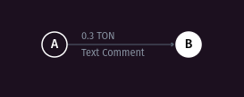
>
> <https://testnet.tonviewer.com/transaction/7f2710c570ebf4e914a0c86e6758749024163766ecfcb6d550fad451f314b4a7>

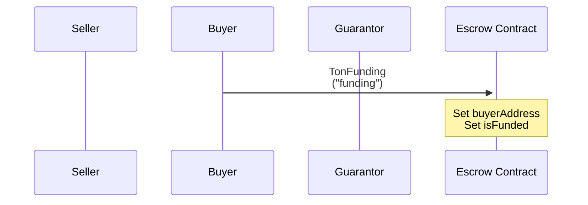

### Fund with Jetton

> 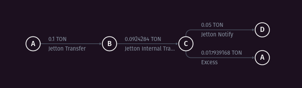
>
> <https://testnet.tonviewer.com/transaction/6b40b399f98a415c2a33db9a2a9d7b64391601bbd6e903634bcc7d955c0a4587>

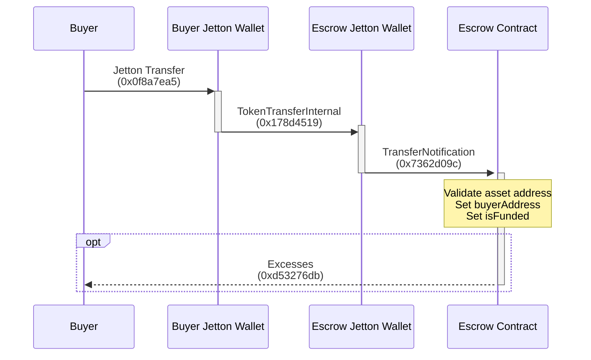

### Approve TON

> 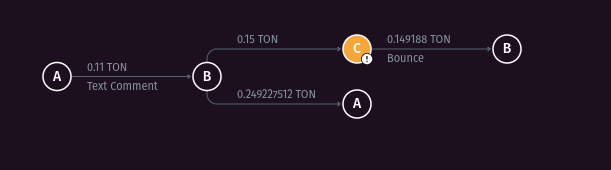
>
> <https://testnet.tonviewer.com/transaction/1207cf71d0bdd9847feaac8798dd77303ffcac1c1e345b266bdcfe40af9e95de>

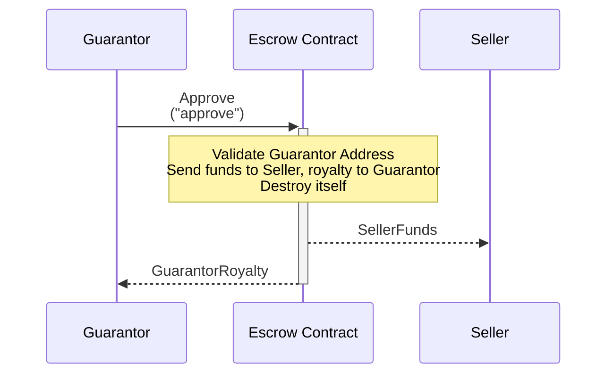

### Cancel TON

> 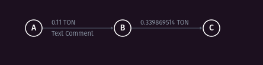
>
> <https://testnet.tonviewer.com/transaction/8318d0f93dd9fde374fc30d01553769cb733317e6c1f791d75a0b6f79e3f19d7>

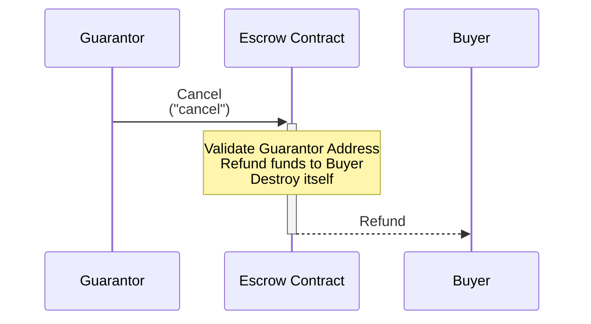

### Approve Jetton

> 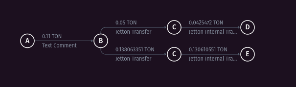
>
> <https://testnet.tonviewer.com/transaction/d54c9d37d81fe47f08037c79d9d3b09ff893a9543b9fd94319eb91a0f0f7879e>

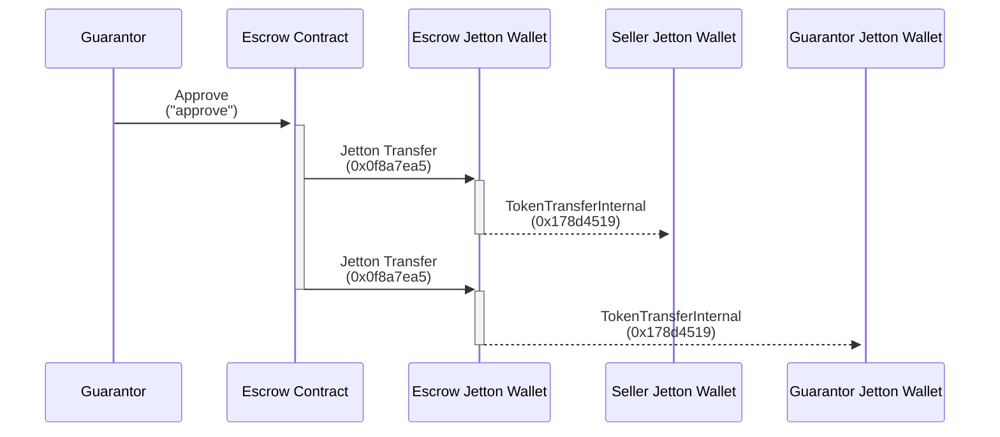

### Change wallet code

> 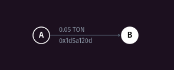
>
> <https://testnet.tonviewer.com/transaction/11b1ffdb0db1551d1752fc4a587a62bb9fd99a9ff8989fbf831d3034914744d9>

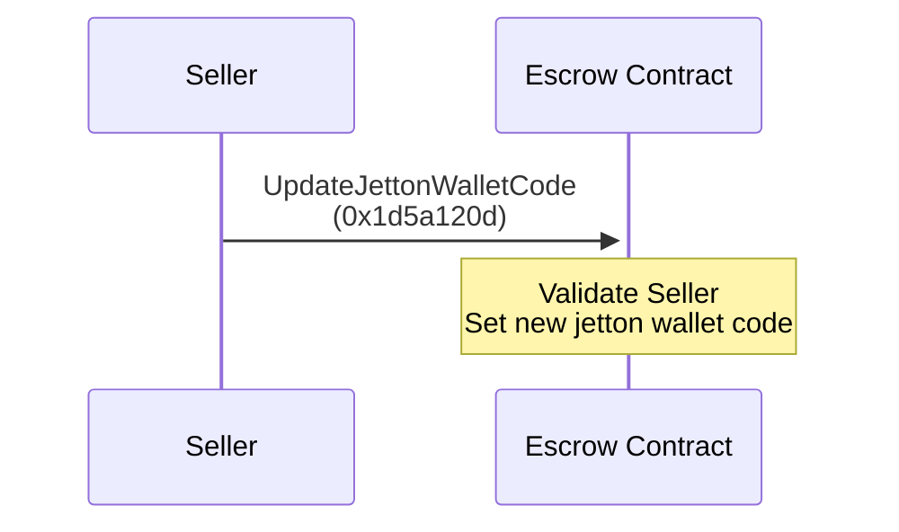

### Provide Escrow Data OnChain

> 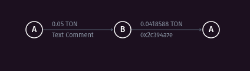
>
> <https://testnet.tonviewer.com/transaction/d678f99f61d69559cabacc8128b3c07453750c6baf722d9b4569581475fdb71c>

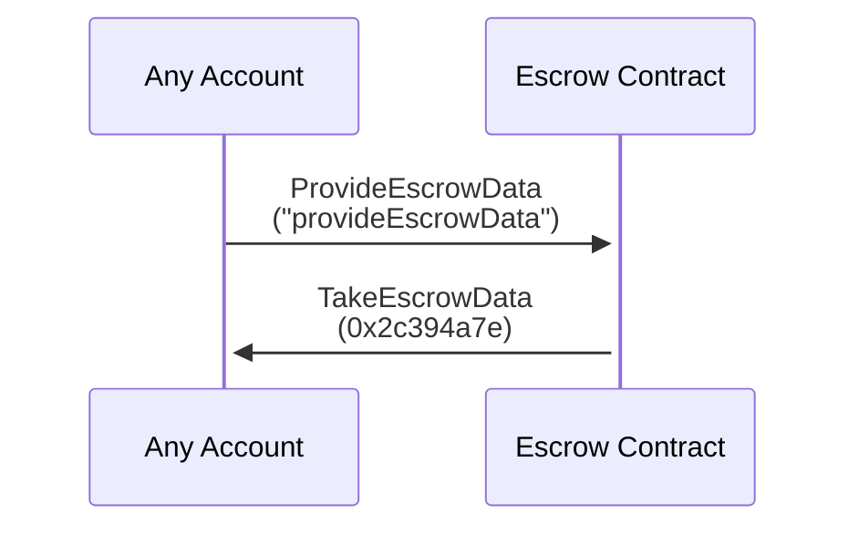

## TLB

TLB Schemes for Opcodes and Storage are auto-generated by Tact toolchain, so this section needs to be updated whenever the contract code changes

TLB Schemes with everything Jetton-related are compatible with [TEP-74](https://github.com/ton-blockchain/TEPs/blob/master/text/0074-jettons-standard.md)

### UpdateJettonWalletCode

`update_jetton_wallet_code#1d5a120d newJettonWalletCode:^cell = UpdateJettonWalletCode`

Signature: `UpdateJettonWalletCode{newJettonWalletCode:^cell}`

### TakeEscrowData

`take_escrow_data#2c394a7e escrowData:EscrowData{id:uint32,sellerAddress:address,guarantorAddress:address,dealAmount:coins,guarantorRoyaltyPercent:uint32,isFunded:bool,assetAddress:Maybe address,jettonWalletCode:Maybe ^cell,buyerAddress:Maybe address} = TakeEscrowData`

Signature: `TakeEscrowData{escrowData:EscrowData{id:uint32,sellerAddress:address,guarantorAddress:address,dealAmount:coins,guarantorRoyaltyPercent:uint32,isFunded:bool,assetAddress:Maybe address,jettonWalletCode:Maybe ^cell,buyerAddress:Maybe address}}`

### EscrowData

`_ id:uint32 sellerAddress:address guarantorAddress:address dealAmount:coins guarantorRoyaltyPercent:uint32 isFunded:bool assetAddress:Maybe address jettonWalletCode:Maybe ^cell buyerAddress:Maybe address = EscrowData`

Signature: `EscrowData{id:uint32,sellerAddress:address,guarantorAddress:address,dealAmount:coins,guarantorRoyaltyPercent:uint32,isFunded:bool,assetAddress:Maybe address,jettonWalletCode:Maybe ^cell,buyerAddress:Maybe address}`

## Project structure

- `contracts` - contains the source code of all the smart contracts of the project and their dependencies
- `contracts/ft` and `wrappers/ft` - contains TEP jetton contracts and wrappers
- `wrappers` - contains exports for auto-generated wrappers
- `tests` - tests for the escrow contract
- `scripts` - contains CLI application as blueprint script

## How to use

### Using the CLI application

CLI application is implemented as blueprint script, use `npx blueprint run` to launch it and then follow terminal instructions

### Testing

This implemetation includes comprehensive testing of both TON and Jetton type of deals and payments, they are separated in the corresponding files

Run `npx blueprint test` to launch them
